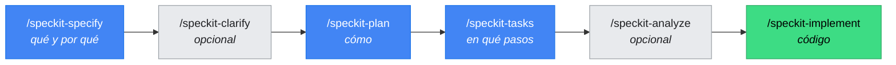
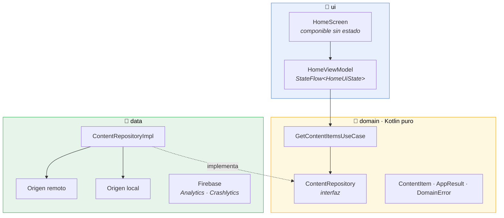

<div align="center">

# BOCantabria

**Aplicación Android nativa para el Boletín Oficial de Cantabria**

[](https://github.com/jrcosio/BOCantabria_v2/actions/workflows/android.yml)
[](https://kotlinlang.org)
[](https://developer.android.com/compose)
[](https://developer.android.com)
[](LICENSE)

*Arquitectura limpia · MVVM · Koin · Firebase · Spec-Driven Development*

</div>

---

## Qué es esto

Reescritura desde cero (v2) de la aplicación del **Boletín Oficial de Cantabria** en Android
nativo con Kotlin y Jetpack Compose.

El proyecto se distingue por **cómo** se construye: aquí no se escribe código de producto sin
una especificación aprobada. Toda funcionalidad recorre el ciclo de
[GitHub Spec Kit](https://github.com/github/spec-kit) antes de tocar una sola línea, y la
arquitectura no es una convención que se respeta por buena voluntad: **está protegida por
tests que fallan si alguien la rompe.**

> [!IMPORTANT]
> Las normas vinculantes del proyecto viven en
> [`.specify/memory/constitution.md`](.specify/memory/constitution.md).
> La guía operativa del día a día está en [`CLAUDE.md`](CLAUDE.md).

---

## Estado

| | |
|---|---|
| **Versión** | 2.0.0 |
| **Fase** | Consulta, búsqueda, guardados, lectura del PDF oficial, resumen IA y pantalla Acerca de |
| **Pruebas** | Suite unitaria y de interfaz automatizada |
| **Arranque** | 648 ms medidos *(objetivo: < 3 s)* |
| **Orientación** | Solo vertical en teléfonos |
| **Capa de datos** | Room como única fuente de verdad, OkHttp para las diecinueve fuentes. Decidido y justificado en `specs/003-boletin-del-dia/research.md` |
| **Documento oficial** | Se descarga validado, se cachea y se lee sin salir de la aplicación. `specs/004-detalle-publicacion/research.md` |

---

## Puesta en marcha

### Requisitos

- **Android Studio** (aporta el JDK 21 que usa el proyecto)
- **Android SDK** con la plataforma **API 37**
- Un emulador o dispositivo con **Android 9** (API 28) o superior

### Arrancar

```bash
git clone https://github.com/jrcosio/BOCantabria_v2.git
cd BOCantabria_v2

# Java no suele estar en el PATH; se usa el JDK que trae Android Studio
export JAVA_HOME="/Applications/Android Studio.app/Contents/jbr/Contents/Home"

./gradlew :app:installDebug
```

> [!NOTE]
> El fichero `app/google-services.json` ya está en el repositorio y apunta al proyecto Firebase
> `bocantabria-6e90f`. Está registrado con el `applicationId` **`com.jrblanco.boccantabria`**
> (con doble «c»), así que **no lo renombres** sin dar de alta antes una app nueva en la consola
> de Firebase.

### Comandos

| Qué hace | Comando |
|---|---|
| Compilar | `./gradlew :app:assembleDebug` |
| Pruebas unitarias, integración y arquitectura | `./gradlew :app:testDebugUnitTest` |
| Pruebas de interfaz *(requiere emulador)* | `./gradlew :app:connectedDebugAndroidTest` |
| Análisis estático | `./gradlew :app:lintDebug` |
| Una prueba concreta | `./gradlew :app:testDebugUnitTest --tests "*HomeViewModelTest*"` |
| Instalar en el dispositivo | `./gradlew :app:installDebug` |

Informes: `app/build/reports/tests/testDebugUnitTest/index.html` y
`app/build/reports/lint-results-debug.html`.

---

## Cómo se trabaja aquí

Toda feature recorre el ciclo completo. **Sin `tasks.md` aprobado no se escribe código de
producto.**



| Comando | Para qué | Produce |
|---|---|---|
| `/speckit-specify` | Arranque de toda feature | Rama `NNN-slug` + `specs/NNN-slug/spec.md` |
| `/speckit-clarify` | Resolver ambigüedades *(opcional)* | Actualiza `spec.md` |
| `/speckit-plan` | Diseño técnico y decisiones | `plan.md`, `research.md`, `data-model.md`, `contracts/` |
| `/speckit-tasks` | Descomposición ejecutable | `tasks.md` |
| `/speckit-analyze` | Coherencia entre artefactos *(opcional)* | Informe de huecos |
| `/speckit-implement` | Ejecutar las tareas | Código y pruebas |

**Exentos del ciclo:** arreglos de build, subidas de versión, erratas y documentación.

Cada feature deja su rastro completo en `specs/`. La primera,
[`001-esqueleto-arquitectura`](specs/001-esqueleto-arquitectura/), sirve de ejemplo de cómo
queda una feature bien documentada.

---

## Arquitectura

Arquitectura limpia por capas con MVVM. **Las dependencias apuntan siempre hacia dentro.**



**Las reglas, en una frase cada una:**

- `domain` es **Kotlin puro**: cero `android.*`, cero Compose, cero Firebase, cero referencias a
  `data` o `ui`. Se puede probar sin emulador.
- `data` implementa lo que `domain` declara. Sus DTOs y entidades **no cruzan** a `ui`: se
  traducen a modelos de dominio.
- `ui` habla **solo** con casos de uso. Un `ViewModel` nunca importa nada de `data`.
- Los SDK de Firebase se tocan **únicamente** desde `data/telemetry`, detrás de las abstracciones
  `AnalyticsTracker` y `CrashReporter`.

> [!TIP]
> Estas reglas no son un acuerdo de caballeros: `ArchitectureRulesTest` las comprueba con
> [Konsist](https://github.com/LemonAppDev/konsist) en cada build. Añade `import android.content.Context`
> a una clase de `domain` y la build falla.

### Estructura de paquetes

```
com.jrblanco.boccantabria
├── core
│   ├── di            Módulos Koin · appModules es el único punto de entrada
│   ├── telemetry     Contratos AnalyticsTracker y CrashReporter
│   ├── ui/theme      Sistema de diseño: 39 tokens de color, 14 estilos, espaciado, formas
│   ├── ui/component  Componibles compartidos sin estado
│   └── util          Dispatchers, tiempo y aleatoriedad, todos inyectados
├── data
│   ├── repository    Implementaciones de los contratos de domain
│   ├── source/local  Room: base de datos, entidades, DAOs y conversores
│   ├── source/remote OkHttp, catálogo de las 19 fuentes, analizador y normalizador
│   └── telemetry     Firebase · ÚNICO sitio que toca el SDK
├── domain
│   ├── model         Publication · BocSection · HomeSelection · AppResult · DomainError
│   ├── repository    Interfaces (contratos)
│   └── usecase       Casos de uso, una operación por clase
├── ui
│   ├── splash        Arranque: comprueba, prepara y da paso a Inicio
│   ├── main          Armazón: panel de secciones + barra inferior
│   ├── detail        Detalle de la publicación: cabecera, pestañas y ficha
│   ├── pdf           Visor del documento · ÚNICO sitio que toca androidx.pdf
│   ├── ask           Preguntar sobre el documento · «Próximamente»
│   ├── share         Envío del PDF por FileProvider, común a las tres pantallas
│   ├── home          Inicio: cabecera, chips y tarjetas de publicación
│   ├── sections      Panel lateral con las nueve secciones del BOC
│   ├── search/saved  Destinos reales, «Próximamente» por ahora
│   └── navigation    Rutas tipadas, NavHost y barra inferior
├── BOCantabriaApp    Application · arranca Koin
└── MainActivity      Anfitrión de la navegación
```

### Stack

| Área | Elección | Por qué |
|---|---|---|
| **UI** | Jetpack Compose + Material 3 | Sin XML de layouts ni Fragments |
| **Presentación** | MVVM con `StateFlow` | Estado inmutable y sellado: los estados imposibles no compilan |
| **Inyección** | [Koin](https://insert-koin.io) 4.2 | Grafo declarado en un sitio y **verificado por un test** |
| **Navegación** | Navigation Compose 2.10 | Rutas tipadas: una ruta mal escrita es un error de compilación |
| **Asincronía** | Corrutinas + `Flow` | Los `Dispatchers` se inyectan, nunca se referencian estáticamente |
| **Telemetría** | Firebase Analytics + Crashlytics | Siempre tras abstracción propia, sustituible en pruebas |
| **Configuración** | Firebase Remote Config | Versión mínima soportada y avisos de mantenimiento, sin publicar versión nueva |
| **Persistencia** | [Room](https://developer.android.com/training/data-storage/room) 2.8 | Un corpus de ~1.900 anuncios con inserción-o-actualización, consultas y `Flow`. **Nunca borra** |
| **Red** | [OkHttp](https://square.github.io/okhttp/) 5, sin Retrofit | Diecinueve GET de XML crudo: no hay API tipada que convertir |
| **XML** | DOM de `javax.xml.parsers` | Kotlin puro, así sus ~50 pruebas corren sin emulador |
| **Visor de PDF** | [`androidx.pdf`](https://developer.android.com/jetpack/androidx/releases/pdf) 1.0.0-beta01 | El oficial de Jetpack, componible. Dibuja en otro proceso y exige `minSdk 28`: de ahí la enmienda 1.1.0 de la constitución |
| **Fechas** | `java.time` nativo | El tipo correcto para una fecha sin hora. Con `minSdk 28` no hace falta azucarado |

Todas las dependencias se declaran en
[`gradle/libs.versions.toml`](gradle/libs.versions.toml). Nunca una versión literal dentro de un
`build.gradle.kts`.

---

## Pruebas

**Ninguna tarea se da por terminada sin su prueba en verde.** Está prohibido desactivar,
ignorar o comentar una prueba para que pase la build.

| Tipo | Dónde | Herramientas | Qué protege |
|---|---|---|---|
| **Unitarias** | `app/src/test` | JUnit 4, MockK, Turbine, `coroutines-test` | Casos de uso, repositorios y modelos de pantalla |
| **Integración** | `app/src/test` | Koin + Robolectric | Que el grafo resuelve y que las capas están enchufadas entre sí |
| **Arquitectura** | `app/src/test` | Konsist | Que nadie rompe la regla de dependencias |
| **Interfaz** | `app/src/androidTest` | Compose UI Test | Los cuatro estados de pantalla, el reintento y el giro del dispositivo |

```bash
./gradlew :app:testDebugUnitTest         # 356 pruebas · ~8 s · sin emulador
./gradlew :app:connectedDebugAndroidTest # 68 pruebas · requiere emulador (en tres botones)
```

La integración continua ejecuta compilación, pruebas sin dispositivo y análisis estático en cada
push y cada pull request. Las pruebas de interfaz se ejecutan en local, contra un emulador.

---

## Firebase

El proyecto usa **Analytics** y **Crashlytics** del proyecto `bocantabria-6e90f`.

Para ver los eventos en tiempo real durante el desarrollo:

```bash
adb shell setprop debug.firebase.analytics.app com.jrblanco.boccantabria
```

Y después, en la consola de Firebase, **Analytics → DebugView**.

> [!WARNING]
> **Nunca** se registran datos personales identificables. `AnalyticsEvent` descarta por sí mismo
> las claves sensibles (correo, teléfono, identificadores de usuario, ubicación…) antes de
> enviar nada, y hay una prueba que lo verifica.

---

## Documentación

| Documento | Contenido |
|---|---|
| [`.specify/memory/constitution.md`](.specify/memory/constitution.md) | **La norma.** Principios vinculantes del proyecto |
| [`CLAUDE.md`](CLAUDE.md) | **La guía operativa.** Comandos, convenciones y trampas conocidas |
| [`specs/`](specs/) | Una carpeta por feature: qué, por qué, cómo y en qué pasos |

Si enmiendas la constitución, actualiza `CLAUDE.md` en el mismo cambio.

---

<div align="center">

Hecho por [J. Ramón Blanco](https://github.com/jrcosio) · Licencia [MIT](LICENSE)

</div>
